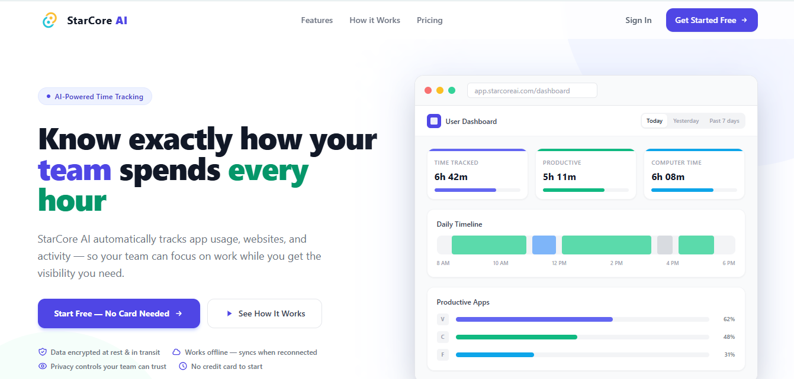
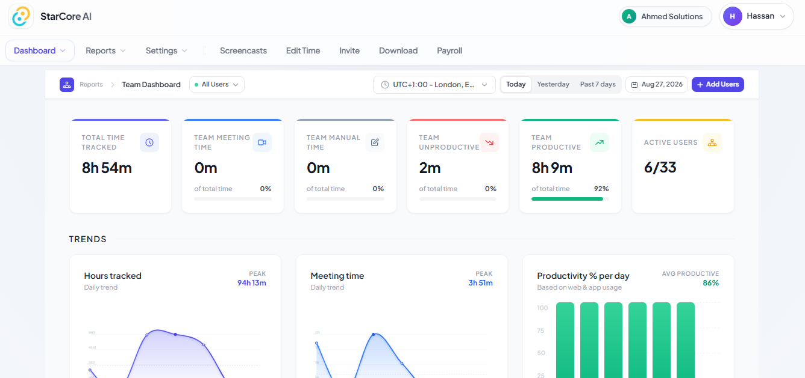
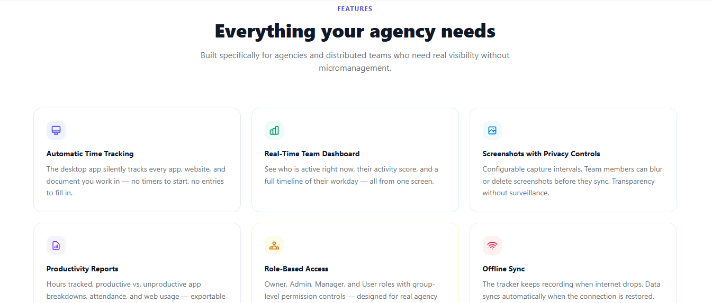
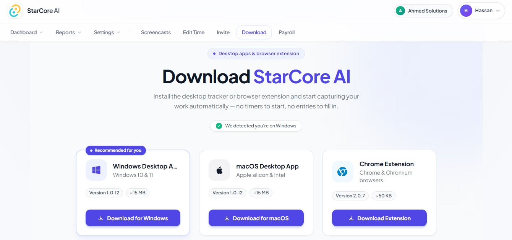

# StarCore AI

**Production SaaS · Real Users**

A time-tracking platform built from scratch and used by real teams. This repo is a public showcase of the product, architecture, and engineering decisions — the production source code is kept in a private repository.

🔗 **Live product:** https://www.starcoreai.com/
🔗 **Portfolio case study:** https://hassanyar.vercel.app/

---

## Problem

Businesses need a reliable way to track employee time and understand how their teams spend their working hours. Most teams end up relying on manual tracking and scattered tools that don't talk to each other.

## Solution

StarCore AI brings time tracking, activity monitoring, and team productivity insights into one platform. Employees track time with a native desktop app; managers get a real-time view of team activity and productivity trends without chasing spreadsheets.

## Key features

- Native desktop time tracking (built with Tauri, not a wrapped web view)
- Real-time activity monitoring per team member
- Team productivity dashboards and reporting
- Reliable, duplicate-free time entries even under concurrent multi-user load

## Screenshots

| Landing page | Dashboard |
|---|---|
|  |  |

| Features | Team tracking |
|---|---|
|  |  |

## Tech stack

**Frontend:** React, Next.js, TypeScript, Tailwind CSS, Tauri (desktop shell), Rust
**Backend:** Node.js, Prisma
**Database:** PostgreSQL, Supabase
**Infrastructure:** Cloudflare R2, Render, Vercel, GitHub Actions

## Technical decisions

**1. Server-side session control to prevent bad time entries**
Time tracking is designed around server-side session control and event processing, which prevents duplicate or overlapping time entries. This mattered once the app went into production with multiple users tracking simultaneously — small timing or synchronization issues could otherwise silently produce incorrect hours, which is the one failure mode a time-tracking product can't afford.

**2. Native desktop app over a web wrapper**
Built the tracker as a real Tauri + Rust desktop application rather than an Electron or browser-based tracker, for lower resource usage and more reliable background activity tracking than a browser tab can provide.

**3. Supabase + PostgreSQL for real-time team views**
Chose Supabase on top of PostgreSQL to get real-time subscriptions for live team dashboards without building a separate real-time layer from scratch.

## Engineering challenges

Keeping tracked time accurate and non-duplicated across concurrent sessions was the hardest part of this product — timing edge cases (network drops, sleep/wake, app crashes mid-session) all had to resolve to a single correct time entry rather than silently duplicating or losing time.

---

### Why no source code here?

This repository showcases the product and the engineering behind it. The production codebase is private to protect client and business logic. Happy to walk through the architecture or specific implementation details directly — reach out via the links on my [profile](https://github.com/hassan-yar-khan).
